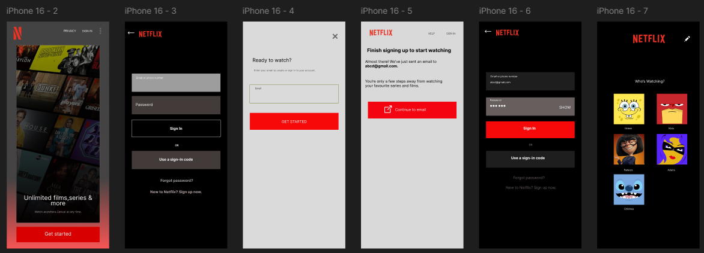
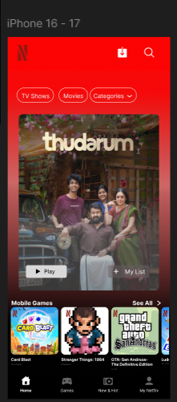
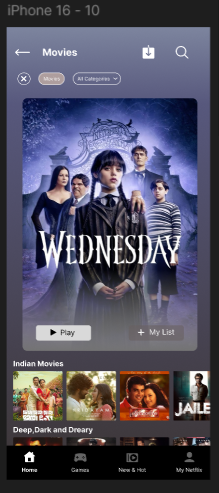
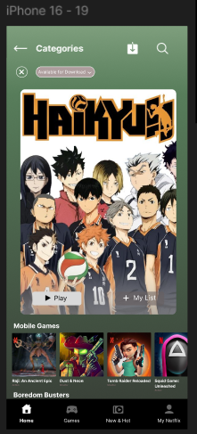
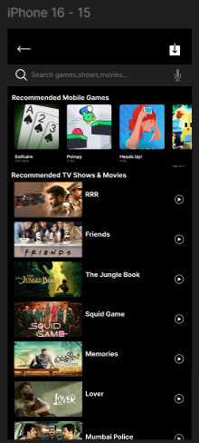

# 🎬 Netflix Mobile UI Design

## 📌 About The Project

A Netflix-inspired mobile application UI/UX design created using Figma.

This project focuses on creating a modern streaming platform interface with clean navigation, responsive layouts, and visually appealing user interactions.

---

## ✨ Features

- Splash Screen
- Login Interface
- Search Screen
- Movie Details Screen
- TV Show Interface
- Categories Page
- Downloads Section
- Modern Dark UI

---

## 🎨 Design Tool

- Figma

---

## 📸 Screens Preview

### Splash Screen

---

### Login Screen

---

### Home Screen

---

### Movies Screen

---

### Categories Screen

---

### Search Screen

---
## 🔗 Figma Prototype

[View Interactive Prototype](https://www.figma.com/proto/tGyR3Kr1VZbUQ6kHokIqu0/Netflix?node-id=24-39&p=f&t=Sprr7eZYAEHk1NKY-1&scaling=scale-down&content-scaling=fixed&page-id=0%3A1&starting-point-node-id=24%3A39)

## 👩‍💻 Author

Sreya Shinu
